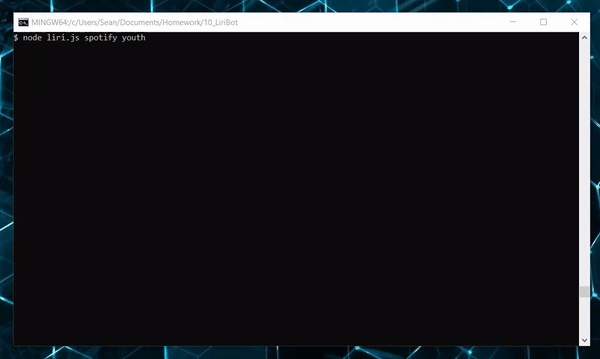
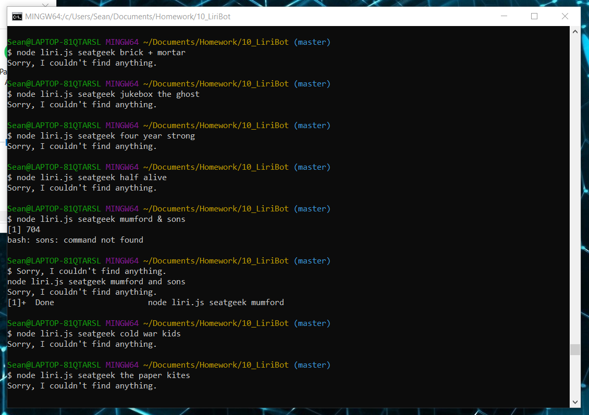

# LIRI Bot

## About LIRI

This is a simple application that takes a search query and returns information on movies, songs, or upcoming concerts.

---

## Requirements

- node
- `.env` file containing your API keys, in this format:

```javascript
OMDB_KEY= ************

SEATGEEK_ID= ************
SEATGEEK_SECRET= ************

SPOTIFY_ID= ************
SPOTIFY_SECRET= ************

// IMPORTANT: REPLACE ALL THE ************ WITH YOUR OWN KEYS, OR THIS WILL NOT WORK

```

We'll also need a few node packages before we get LIRI working:

- axios
- spotify
- moment

Don't worry about doing this manually; the included `package.json` will help here.

```
$ npm i
```

---

## Using LIRI

Running `liri.js` without any arguments won't do a lot; use `omdb`, `seatgeek`, or `spotify`, followed by a movie name, music artist, or song name, respectively.

Here's an example:



Alternatively, you can also watch me awkwardly demo the whole app here:
<video controls="controls">

  <source type="video/mp4" src="testvid.mp4"></source>
  <p>Coming soon!(when I figure out how to do this :P)</p>
</video>

---

## Known Issues

The Seatgeek API doesn't always work. I checked it against a couple bands that I knew were touring at the time _AND_ the Seatgeek website where they _DID_ appear, but it doesn't seem to recognize them.


